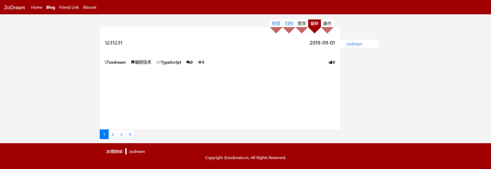
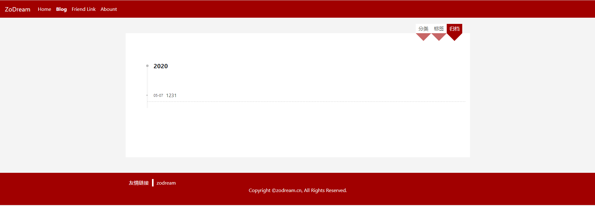
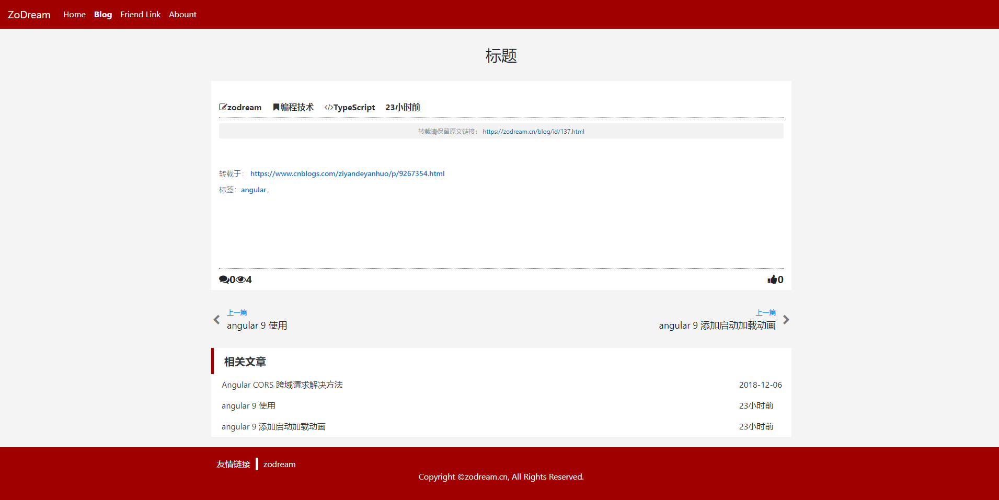
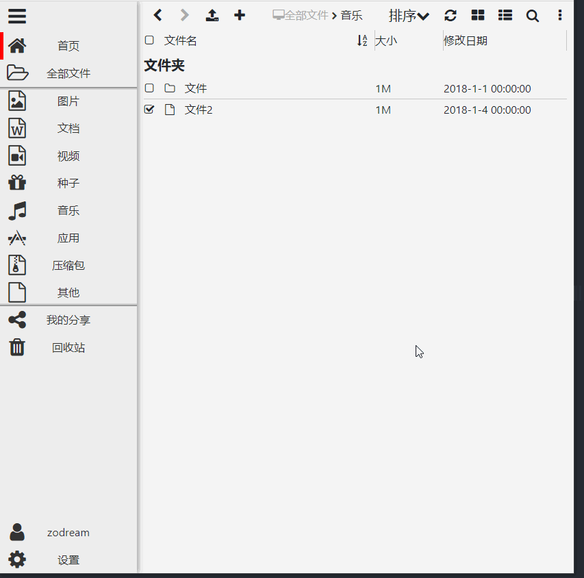
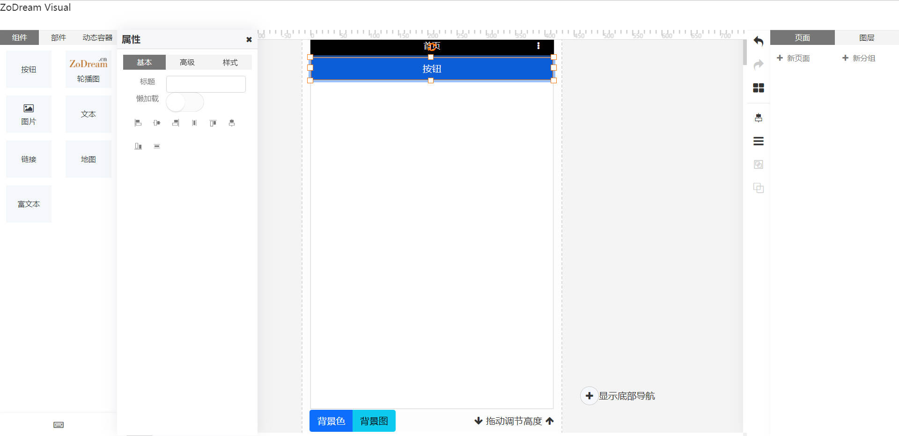

# Angular-ZoDream

Use Angular to implement the interface 

[中文](README.zh.md)

Mandatory update installation dependencies 
```
npm i --legacy-peer-deps
```

## Module list

|Frontend|Backend|Name|Feature|
|:--:|:--:|:--:|:--:|
|√|√|[Auth](src/app/modules/auth)||
|√|√|Blog||
|√|√|Book|Include list|
|-|-|catering||
|√|-|Chat room||
|√|√|Check in||
|-|√|CMS||
|√|-|Online Disk||
|√|√|Document|suport debug API|
|√|√|Exam||
|√|-|Finance||
|√|√|Forum||
|√|√|Legwork||
|√|√|Micro Blog||
|√|√|Online Service||
|√|√|Shop||
|√|-|Task||
|√|√|Short Video||
|√|√|Search||
|-|o|Online Template Editor||
|√|√|WeChat ||
|-|√|Database Manage|suport copy table|

    - Means not started or not done 
    o Indicates that a part has been done but not completed 
    √ Is completed, or most of the functions are completed 

## Component

√ [Dialog](src/app/components/dialog)

√ Form Input：[autocomplete](src/app/components/form/autocomplete), [action button](src/app/components/form/action-button) etc

√ [Check in](src/app/modules/checkin)

√ [Mind editor](src/app/components/mind)

√ [Markdown editor](src/app/components/editor/markdown-editor)

√ [datepicker](src/app/components/datepicker)

√ [context menu](src/app/components/context-menu)

√ [editor](src/app/components/editor)

√ [media player](src/app/components/media-player)

√ [toast](src/app/components/dialog)

√ [emoji picker](src/app/theme/components/emoji-picker)

√ [pagination](src/app/theme/components/pagination)

√ [editable table](src/app/theme/components/editable-table)

√ [pull to refresh](src/app/theme/components/pull-to-refresh)

√ circle progress

√ Gua gua le

√ turntable

√ lattice


## Preview

👉【[DEMO](https://job.zodream.cn/)】

1. Blog Preview

Like [https://zodream.cn/](https://zodream.cn/)







2. Disk Preview



3. Chat Room Preview


4. Visual Editor



## Process

Continue to improve 

## Command

```shell
# Installation dependencies 
npm i
# Start local preview 
ng serve
# Generate official code 
npm run prod
# Extract files to be translated 
npm run i18n

```