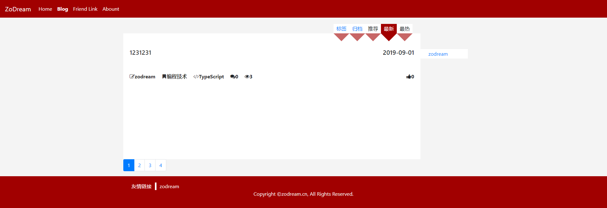
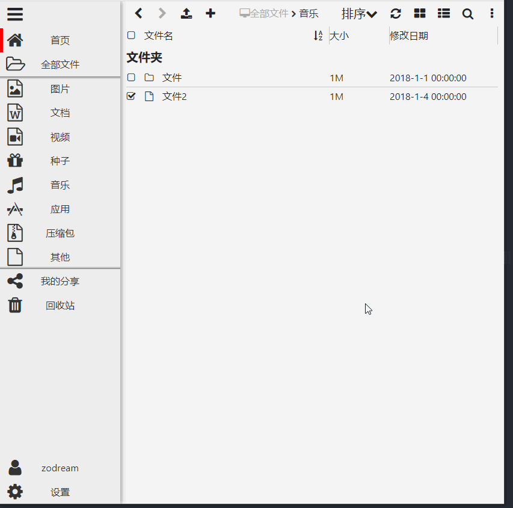

# Angular-ZoDream
使用Angular实现界面

强制更新安装依赖
```
npm i --legacy-peer-deps
```

## 模块列表

|前台状态|后台状态|模块名|特色功能|
|:--:|:--:|:--:|:--:|
|√|√|登录||
|√|√|博客||
|√|√|小说|支持书单、支持人物关系图|
|-|-|catering||
|√|-|聊天||
|√|√|签到||
|-|√|CMS||
|√|-|网盘||
|√|√|文档|支持API调试|
|√|√|题库||
|√|-|个人记账||
|√|√|论坛|悬浮用户信息卡片（包含统计信息、会员卡等），|
|√|√|跑腿||
|√|√|微博客||
|√|√|在线客服||
|√|√|商城||
|√|-|任务||
|√|√|短视频||
|√|√|搜索导航||
|-|o|在线模板编辑||
|√|√|公众号管理||
|-|√|数据库管理|支持数据复制迁移|

    - 表示未开始或未做
    o 表示做了一部分，未完成
    √ 便是已完成，或完成大部分功能

## 组件

√ 弹窗组件

√ 搜索弹窗组件

√ 文件浏览组件

√ 表单组件：自动完成、单复选框、颜色选择、倒计时按钮、日期选择、文件上传、密码验证、地区选择、下拉选择、评价、开关、时间选择

√ 签到组件

√ 关系编辑组件

√ Markdown编辑器组件, 富文本编辑器（完全基于angular实现的）

√ 日期选择组件

√ 右键菜单组件

√ 富文本显示组件

√ 音视频播放组件

√ 消息对话框组件

√ emoji选择组件

√ 分页组件

√ 自定义分页表格组件

√ 下拉刷新触底加载更多组件

√ 圆形进度条组件

√ 刮刮乐组件

√ 九宫格抽奖组件

√ 转盘抽奖组件


## 预览图

👉【[DEMO](https://job.zodream.cn/)】

1. 博客样式

参考样式 [https://zodream.cn/](https://zodream.cn/)




2. 网盘样式



3. 聊天室样式


4. 可视化编辑器


## 当前状态

继续完善中

## 命令

```shell
# 安装依赖
npm i
# 启动本地预览
ng serve
# 生成正式代码
npm run prod
# 提取待翻译文件
npm run i18n

```

## 改变主题颜色

在 `src/index.html` 添加
```html
<meta name="theme-color" content="#A10000">
```
在 `src/manifest.webmanifest` 设置不一定有效

```
"theme_color": "#A10000",
```